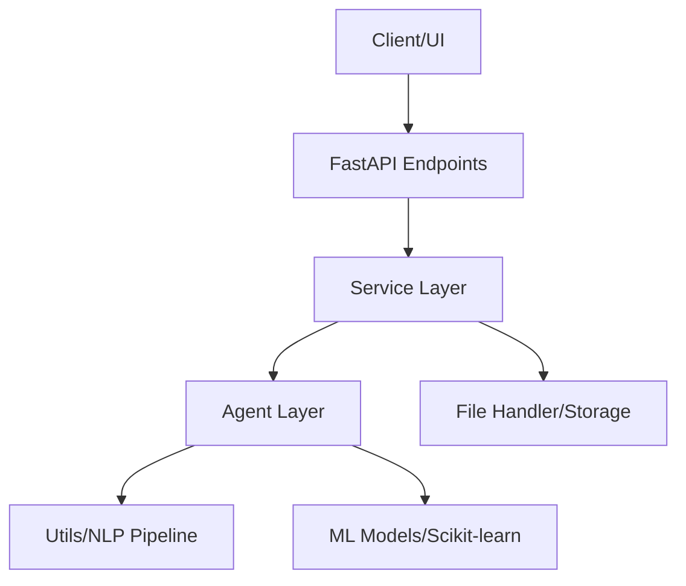

# 🛡️ Intelligent AI-Powered Spam Email Detection System

[](https://fastapi.tiangolo.com/)
[](https://www.python.org/)
[](https://scikit-learn.org/)
[](https://www.nltk.org/)

A high-performance, production-grade backend system designed for automated spam detection. This project leverages **FastAPI** for high-concurrency API handling and **Scikit-learn** combined with **NLTK** for sophisticated Natural Language Processing (NLP) and Machine Learning (ML).

---

## 🚀 Key Features

*   **Modular Architecture**: Built following SOLID principles and Clean Architecture for maximum scalability.
*   **Advanced NLP Pipeline**: Custom preprocessing including tokenization, stopword removal, and Porter Stemming.
*   **Dynamic Model Training**: Supports Logistic Regression and Multinomial Naive Bayes with automated performance evaluation.
*   **AI Agent System**: A decentralized agent-based design for preprocessing, training, evaluation, and generating human-readable insights.
*   **Real-time Inference**: Sub-millisecond prediction response times with confidence scores.
*   **Comprehensive Analytics**: Real-time tracking of system performance, spam/ham distributions, and model health.

---

## 🏗️ System Architecture

The system is organized into a service-based architecture that separates concerns between data handling, business logic, and AI operations.



---

## ⚙️ Workflow & Pipeline

### 1. Data Ingestion & Preprocessing
*   **Upload**: Users upload CSV datasets containing `text` and `label` (spam/ham) columns.
*   **Cleaning**: The `PreprocessingAgent` triggers a pipeline that:
    *   Converts text to lowercase.
    *   Removes special characters and punctuation.
    *   Tokenizes the text into individual words.
    *   Filters out common English stopwords.
    *   Applies **Porter Stemming** to reduce words to their base forms (e.g., "running" -> "run").

### 2. Feature Engineering
*   The system utilizes **TF-IDF (Term Frequency-Inverse Document Frequency)** vectorization. This converts raw text into numerical feature vectors, emphasizing unique words that are highly indicative of spam or ham.

### 3. Model Training & Evaluation
*   Data is split into 80% training and 20% testing sets.
*   The **Multinomial Naive Bayes** model is trained on the vectorized data.
*   Post-training, the `EvaluationAgent` calculates:
    *   **Accuracy**: Overall correctness.
    *   **Precision/Recall**: Specificity and sensitivity towards spam.
    *   **F1-Score**: Harmonic mean of precision and recall.
    *   **Confusion Matrix**: Visualizing true vs. false positives/negatives.

### 4. Inference (Prediction)
*   New emails are preprocessed using the *exact same* pipeline used during training.
*   The trained model provides a classification and a probability-based **confidence score**.

---

## 🤖 AI Agent Architecture

This project implements a lightweight **Agent-Based Design**:

| Agent | Responsibility |
| :--- | :--- |
| **PreprocessingAgent** | Orchestrates text normalization and dataset cleaning. |
| **TrainingAgent** | Manages the training lifecycle, model selection, and serialization. |
| **PredictionAgent** | Handles low-latency inference and model reloading. |
| **InsightAgent** | Transforms technical metrics into human-readable AI recommendations. |

---

## 📡 API Reference

### 🛠️ Core Endpoints

| Method | Endpoint | Description |
| :--- | :--- | :--- |
| `GET` | `/health` | Check system status and version. |
| `POST` | `/api/v1/upload` | Upload a CSV file for training. |
| `POST` | `/api/v1/train` | Trigger training on an uploaded dataset. |
| `POST` | `/api/v1/predict` | Classify a message as spam or ham. |
| `GET` | `/api/v1/analytics` | Get performance stats and AI insights. |

---

## 🛠️ Installation & Setup

### Prerequisites
*   Python 3.12+
*   Virtual Environment (venv/conda)

### Step-by-Step Guide

1.  **Clone the repository**:
    ```bash
    git clone https://github.com/your-username/email-aaanalyser.git
    cd email-aaanalyser/backend
    ```

2.  **Create and activate a virtual environment**:
    ```bash
    python -m venv venv
    source venv/bin/activate  # On Windows: venv\Scripts\activate
    ```

3.  **Install dependencies**:
    ```bash
    pip install -r requirements.txt
    ```

4.  **Set up environment variables**:
    The system comes with a default `.env` configuration. You can modify `backend/.env` to adjust storage paths.

5.  **Start the server**:
    ```bash
    uvicorn app.main:app --reload
    ```

---

## 📂 Project Structure

```text
backend/
├── app/
│   ├── api/v1/endpoints/  # API controllers for routing
│   ├── core/              # Global settings, security, and constants
│   ├── services/          # Business logic (TrainingService, PredictionService)
│   ├── models/            # Pydantic schemas for data validation
│   ├── utils/             # Reusable logic (TextCleaner, FileHandler)
│   ├── agents/            # Specialized AI agents for ML/NLP tasks
│   └── main.py            # FastAPI application startup
├── datasets/              # Original dataset storage
├── trained_models/        # Saved .joblib models and performance JSONs
├── uploads/               # Temporary storage for uploaded CSVs
└── requirements.txt       # Project dependencies
```

---

## 📄 License

This project is licensed under the MIT License - see the [LICENSE](LICENSE) file for details.

---

## 👨‍💻 Author

Developed with ❤️ by **Senior AI Engineer & Backend Architect**. Suitable for portfolio demonstrations and production-style implementation.
